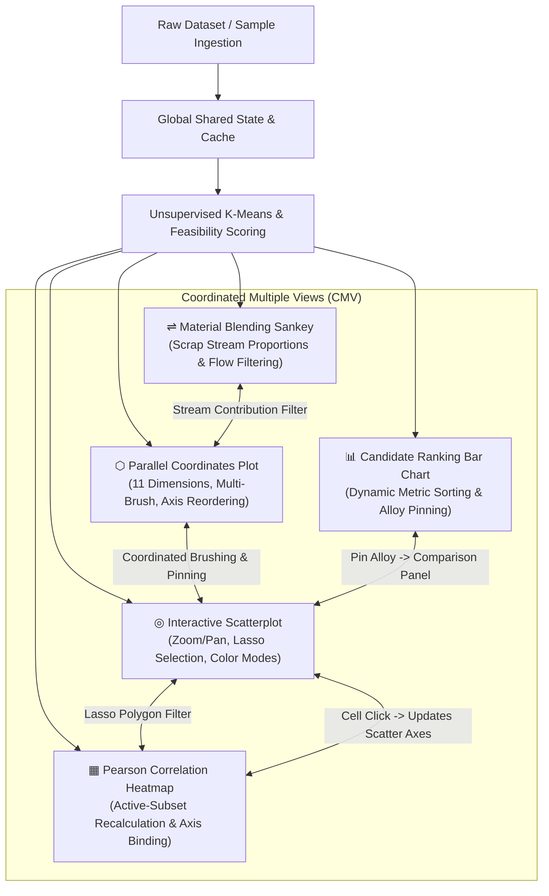

<div align="center">

# ⬡ ScrapLens
### Visual Analytics for Sustainable Aluminium Alloy Discovery

[](https://imami123456.github.io/ScrapLens-Dashboard/)
[](https://d3js.org/)
[](https://developer.mozilla.org/en-US/docs/Web/JavaScript)
[](https://zenodo.org/records/14160521)
[](https://www.uni-passau.de/)
[](LICENSE)

<br/>

<p align="center">
  <strong>An interactive, multi-coordinated visual analytics dashboard engineered to accelerate the discovery and blending of circular aluminium alloys from post-consumer scrap.</strong>
</p>

<p align="center">
  <em>Developed for the IEEE SciVis Contest 2025 by:</em><br>
  <strong>Burhanuddin Imami</strong><br>
  <em>Faculty of Computer Science and Mathematics, University of Passau</em>
</p>

<br/>


</div>

---

## 🌟 Executive Summary

Manufacturing primary aluminium from bauxite ore requires extreme amounts of electrical energy and generates immense greenhouse emissions. Recycling post-consumer aluminium scrap uses **95% less energy**, but scrap streams are heavily contaminated with variable impurity elements. 

**ScrapLens** solves the formulation dilemma by bridging high-dimensional material informatics and interactive visualization. It empowers metallurgists and materials scientists to:
1. **Filter across 11 simultaneous dimensions** (6 input scrap streams + 5 thermomechanical output properties).
2. **Cluster candidate blends** using unsupervised machine learning (*k*-means).
3. **Trace elemental flows** from scrap feedstock into the final recycled blend via Sankey flow dynamics.
4. **Spotlight trade-offs and correlations** dynamically recalculating Pearson coefficients on active subsets.
5. **Pin & compare candidate alloys side-by-side** using a proprietary multi-attribute **Feasibility Score**.

---

## 🚀 Quick Launch & Instant Demo

You can run and test the complete dashboard with **zero software installations**:

### ⚡ 1-Click Instant Demo (No 150MB Download Required!)
1. Open the **[Live Demo](https://imami123456.github.io/ScrapLens-Dashboard/)**.
2. Click the **⚡ Load Sample Dataset (Instant Demo)** button.
3. 1,000 real alloys from the IEEE SciVis Contest 2025 dataset are parsed and visualized immediately!

### 💻 Local Run (Zero Build Tools Required)
Clone the repository and serve it with any local static HTTP server:

```bash
# Clone the repository
git clone https://github.com/Imami123456/ScrapLens-Dashboard.git
cd ScrapLens-Dashboard

# Option A: Python 3 built-in server (recommended)
python3 -m http.server 8080

# Option B: Node.js npx serve
npx serve .

# Option C: VS Code Live Server extension
# Right-click index.html -> "Open with Live Server"
```
Visit `http://localhost:8080` in Chrome, Firefox, or Safari.

> ℹ️ *To analyze the full contest dataset (>100,000 alloys, ~150 MB), download `02a_OUTPUT_Summary.csv` from [Zenodo (Record 14160521)](https://zenodo.org/records/14160521) and load it through the "Choose File" selector.*

---

## 📊 Coordinated Multiple Views (CMV) Architecture

ScrapLens implements **tight bidirectional cross-filtering** across 5 visual components. When you brush, select, or filter in one chart, all other charts respond in real-time.



---

## 🔍 Detailed Feature Guide

| Visualization | Visual Encodings & Purpose | Interactive Capabilities |
| :--- | :--- | :--- |
| **⬡ Parallel Coordinates Plot** | Displays all 11 dimensions (6 scrap inputs + 5 key properties). Each polyline represents a discrete alloy candidate. | • **Multi-Brush Filtering:** Drag grey selection extents along any axis.<br>• **Axis Reordering:** Drag axis labels horizontally to inspect adjacent correlations.<br>• **Line Pinning:** Click any polyline to spotlight and pin across all charts. |
| **◎ Bivariate Scatterplot** | Evaluates non-linear relationships and property trade-offs on a Cartesian plane. | • **Freehand Lasso:** Hold <kbd>Shift</kbd> + Drag to encircle clusters of interest.<br>• **Pan & Smooth Zoom:** Mouse wheel / pinch to zoom in on dense regions.<br>• **Color Modalities:** Toggle between Feasibility gradient and discrete K-Means clusters. |
| **⇌ Scrap Blending Sankey** | Visualizes material balance and mass conservation from 6 input scrap streams into the final alloy mixture. | • **Interactive Stream Isolation:** Click any ribbon to filter the entire dashboard by candidates rich in that specific scrap source.<br>• Dynamic width encoding based on active filter. |
| **📊 Sortable Bar Chart** | Ranks candidates according to the computed Feasibility Score or individual physical properties. | • **Dynamic Sorting:** Ascending/descending toggle.<br>• **Click to Pin:** Pin candidate into the comparative benchmark panel. |
| **▦ Pearson Correlation Heatmap** | Computes pairwise linear correlation matrix for the 5 thermomechanical properties. | • **Reactive Recalculation:** Recomputed on-the-fly whenever brushes or lasso change.<br>• **Direct View Binding:** Click any cell to immediately set those two variables as the Scatterplot X and Y axes. |

### 💎 Advanced Usability Highlights
- **⛶ Fullscreen Expand Mode:** Click "⛶ Expand" on any panel to pop open a high-resolution, full-screen view with a blurred glassmorphism backdrop.
- **📌 Multi-Alloy Pinning Panel:** Compare up to 3 candidate alloys side-by-side with color-coded badges (`#FFD700`, `#00FFFF`, `#FF00FF`).
- **🧠 LocalStorage Persistence:** Ingested datasets and filter configurations survive page reloads.
- **⚡ Dynamic Row Limiter:** Configure row thresholds (from 500 to 100,000) to balance statistical depth and 60fps rendering speed.

---

## 🧮 Mathematical & Scientific Formulation

### 1. Multi-Objective Feasibility Score
To systematically identify top alloy formulations balancing mechanical strength, surface hardness, and castability, we compute a normalized feasibility index:

$$\text{Score}(d) = w_{\text{YS}} \cdot \tilde{x}_{\text{YS}} + w_{\text{HV}} \cdot \tilde{x}_{\text{HV}} + w_{\text{CSC}} \cdot (1 - \tilde{x}_{\text{CSC}})$$

Where:
- $\tilde{x} = \frac{x - x_{\min}}{x_{\max} - x_{\min}}$ (min-max normalization across active dataset)
- $w_{\text{YS}} = 0.40$ (Yield Strength in MPa — higher is better)
- $w_{\text{HV}} = 0.40$ (Vickers Hardness in HV — higher is better)
- $w_{\text{CSC}} = 0.20$ (Crack Susceptibility Coefficient — lower is better, inverted as $1 - \tilde{x}_{\text{CSC}}$)

### 2. Unsupervised K-Means Clustering
Implemented from scratch in pure JavaScript (`kmeans.js`), the clustering algorithm partitions alloys into $k \in [2, 8]$ clusters based on their normalized 11-dimensional feature vectors:

$$J = \sum_{j=1}^{k} \sum_{i=1}^{n} ||x_i^{(j)} - c_j||^2$$

Clusters are rendered using an optimized categorical palette (`CLUSTER_COLORS`), revealing latent clusters of scrap compatibility.

---

## 📂 Repository Structure

```
ScrapLens/
├── index.html                   # Root entry point with auto-redirect for GitHub Pages
├── LICENSE                      # Open-source MIT License
├── README.md                    # Project documentation & portfolio showcase
├── .gitignore                   # Repository clean hygiene rules
├── data_link.txt                # Official Zenodo DOI & dataset metadata
├── group15_ screenshot_part2.png# High-resolution dashboard screenshot
├── group15_ video_part2.mp4     # Demonstration video walkthrough
└── dashboard/                   # Main application suite
    ├── index.html               # Primary application UI & glassmorphism layout
    ├── style.css                # Custom CSS design system (responsive grid, modals)
    ├── dataVis.js               # Data ingestion, pagination & storage engine
    ├── data/
    │   └── sample_alloy_data.tsv# Bundled 1,000-alloy sample dataset (580 KB)
    └── js/
        ├── state.js             # Shared state, constants, color scales
        ├── utils.js             # Normalization, math, tooltips, debounce
        ├── kmeans.js            # Pure JS K-Means clustering algorithm
        ├── chart-pc.js          # Parallel Coordinates Plot implementation
        ├── chart-scatter.js     # Scatterplot with zoom, pan & lasso selection
        ├── chart-sankey.js      # Blending flow Sankey diagram
        ├── chart-bar.js         # Top candidates ranking bar chart
        ├── chart-heatmap.js     # Dynamic Pearson correlation heatmap
        └── dashboard-core.js    # Dashboard coordinator & DOM scaffolding
```

---

## 🌐 Deploying to Your Own GitHub Pages

To host your own live instance of ScrapLens:
1. Push this repository to your GitHub account (`https://github.com/Imami123456/ScrapLens-Dashboard`).
2. Navigate to your repository's **Settings** tab.
3. In the left sidebar, click **Pages**.
4. Under **Build and deployment** &rarr; **Branch**, select `main` and root folder `/` (or `/docs`), then click **Save**.
5. Within 60 seconds, your dashboard will be live at:
   `https://imami123456.github.io/ScrapLens-Dashboard/`

---

## 📜 Dataset Citation & Acknowledgements

The data explored in this tool originates from the **IEEE SciVis Contest 2025**:
- **Dataset:** *High-Throughput Aluminium Scrap Alloy Thermodynamic & Mechanical Simulation*
- **Zenodo DOI:** [10.5281/zenodo.14160521](https://doi.org/10.5281/zenodo.14160521)
- **Course:** Data Visualization (6171 UE), Summer Semester 2026
- **Supervision:** Chair of Cognitive Sensor Systems, Faculty of Computer Science and Mathematics, University of Passau.

---

<div align="center">
  <sub>Engineered with precision using D3.js v7 &bull; Crafted by Burhanuddin Imami</sub>
</div>
